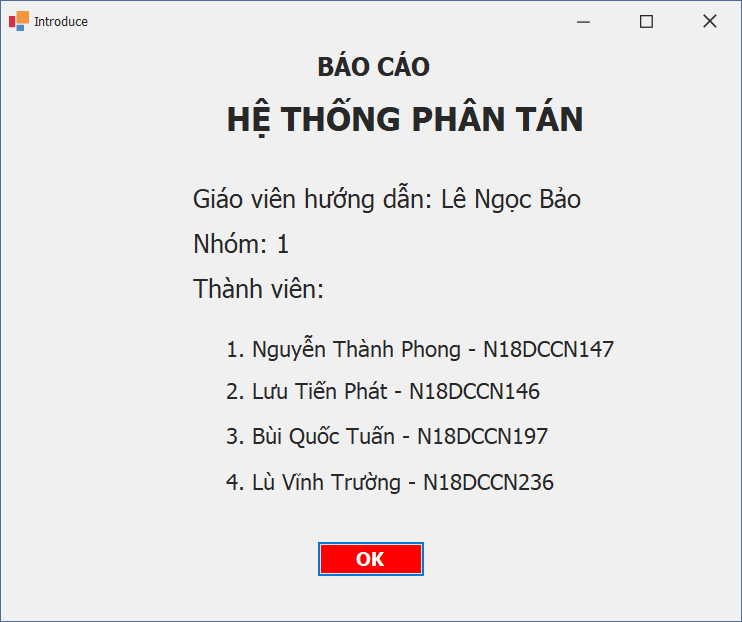
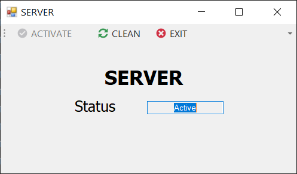
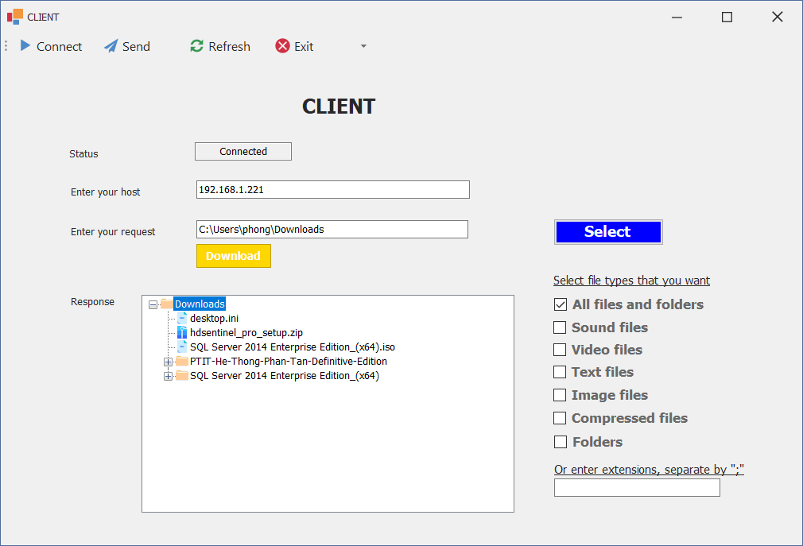
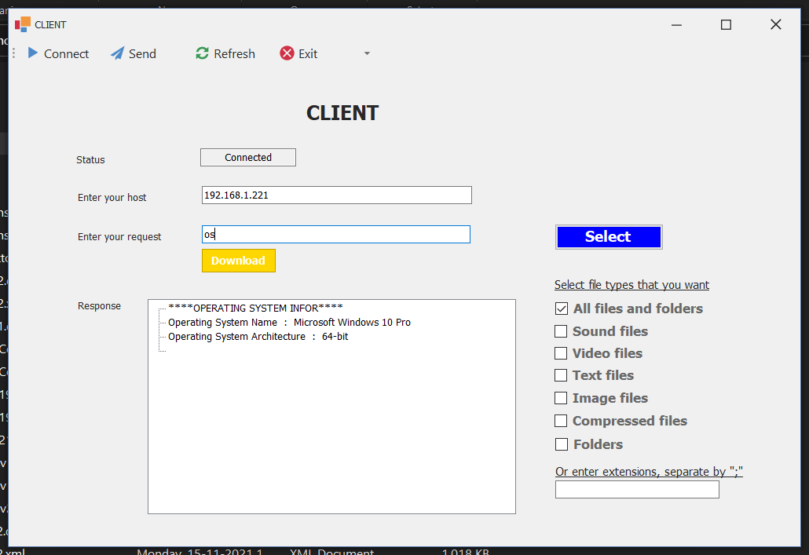
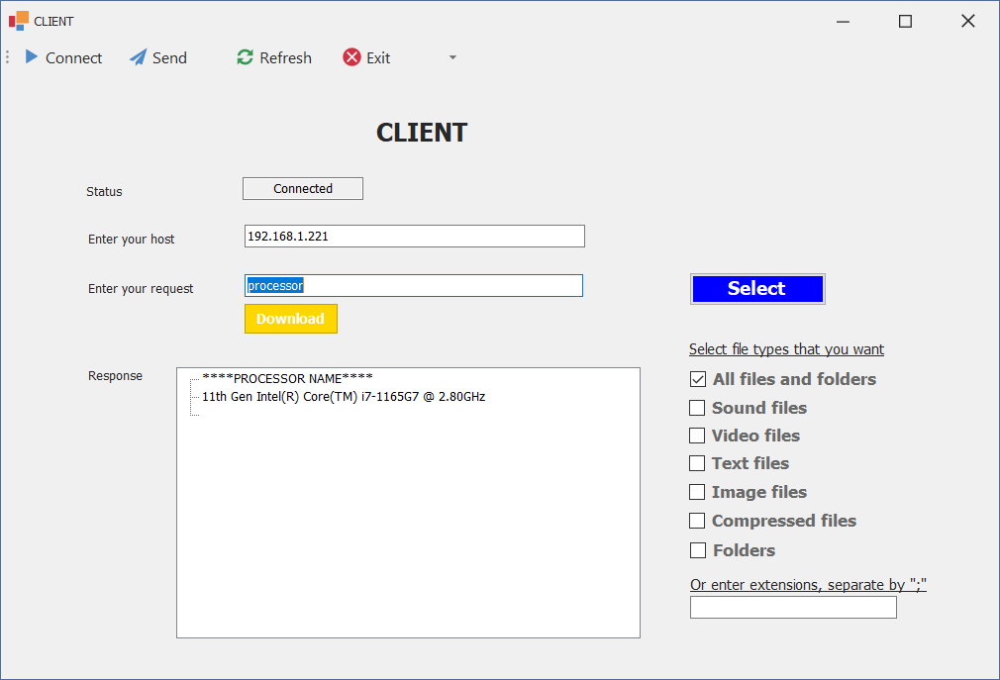
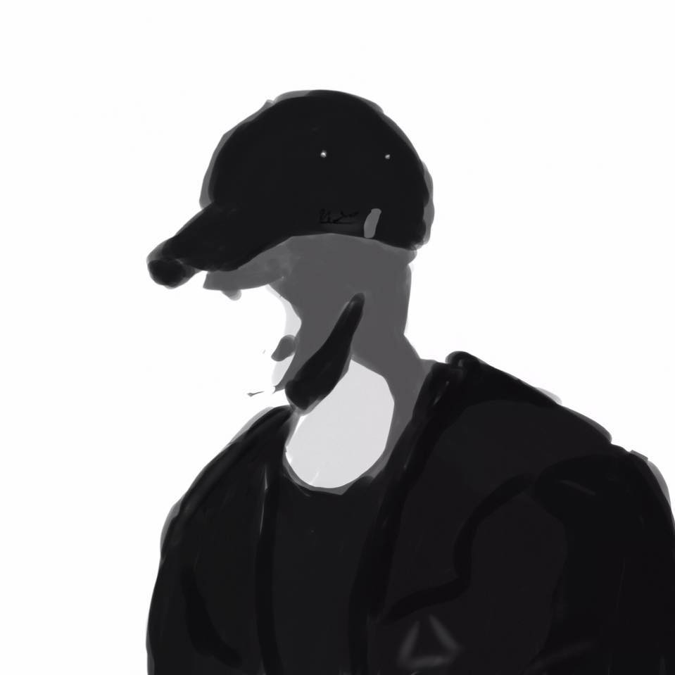

# Hệ Thống Phân Tán
Đây là đồ án giữa kì kiêm cuối kì môn hệ thống phân tán do thầy Lê Ngọc Bảo giảng dạy

# [**Topic**](#)

Dưới đây là chi tiết đề tài của nhóm mình. Là đề tài số 7:
Viết 1 server cho phép nhiều client kết nối cùng lúc với các yêu cầu sau:
Client có thể gửi yêu cầu là đường dẫn đến  1 ổ điã hoặc 1 thư mục nào đó bất kỳ trên server. Nếu đường dẫn đó tồn tại thị sẽ gửi về danh sách các thư mục con và các tập tin trong ổ đĩa / đường dẫn đó.

> *Note: Dự án các bạn đang đọc là dự án hoàn chỉnh cuối cùng của chúng mình. Ngoài ra, còn có một phiên bản khác, mình gọi là bản phác thảo sơ bộ của dự án này. Các bạn có thể xem tại* [**đây**](https://github.com/Phong-Kaster/PTIT-He-Thong-Phan-Tan)

# [**How to run**](#)

Về cơ bản thầy Lê Ngọc Bảo khá là dễ tính. Một buổi học có 4 tiết thì thầy dạy đến 8-9h là kết thúc buổi học rồi. Đề tài phía trên cũng khá dễ thở. Các bạn chỉ cần tải nó về là có thể chạy được.

Tuy nhiên, phải mở ít nhất là 2 tab nhé. Một tab để server chạy, một tab để client chạy và gửi yêu cầu tới server.

Bài làm này mình sử dụng giao thức TCP để kết nối giữa server và client nha.

# [**Premium Features**](#)

Phần này là do mình tự làm thêm vào. Tại đề tài quá dễ mà thầy cho một nhóm có 4-5 người làm. Nên mình tự tìm hiểu thêm và tạo thêm cho chương trình một số chức năng khác như sau:

1. "time" xem giờ hiện tại

2. "photo" mở thư mục chứa ảnh

3. "music" mở trình chơi nhạc

4. "date" xem ngày hôm nay là ngày bao nhiêu

5. "chrome" mở trình duyệt Google Chrome

6. "left 4 dead 2" mở game cùng tên

7. "operating" || "system" || "os" xem thông tin hệ điều hành và kiến trúc phiên bản máy tính

8. "processor" xem thông tin bộ vi xử lý máy tính

9. lọc tệp tin theo loại: sound, text, image, zip,....

Sáu tính năng phía trên là mình làm thêm để tăng kiến thức của chính mình. Các bạn thấy không bắt buộc phải làm đâu nha.

# [**Photo**](#photo)
Sau đây là hình ảnh mô tả dự án này

1. Giao diện cho phía Server - phần giới thiệu
   

      
   

2. Giao diện cho phía Server - phần chính
   

      
   

3. Giao diện cho phía Client
   

      
   

4. Một số tính năng bổ sung - Xem thông tin hệ điều hành
   

      
   

5. Một số tính năng bổ sung - Xem thông tin bộ vi xử lý
   

      
   

# [**Our Team**](#)
 <table>
    <tr>
        <td align="center">
        <a href="https://github.com/Phong-Kaster">
            
             
            <b>Nguyễn Thành Phong</b>
        </a>
    </td>
        <td align="center">
        <a href="https://github.com/truong-lv">
            
             
            <b>Lù Vĩnh Trường</b>
        </a>
    </td>
    <td align="center">
        <a href="https://github.com/LuuTienPhat">
            
             
            <b>Lưu Tiến Phát</b>
        </a>
    </td>
      <td align="center">
        <a href="https://github.com/tuanbuinov09">
            
             
            <b>Bùi Quốc Tuấn</b>
        </a>
    </td>
    </tr>
</table>

Chúc các bạn đang đọc bài của mình sẽ đạt thành tính cao với môn học này.

 
HO CHI MINH, VIETNAM  
9 November, 2021

Nhóm mình cả 4 đứa được 9 điểm nha ! Có điểm nhanh thật mới thi xong hôm qua đã có điểm rồi.
